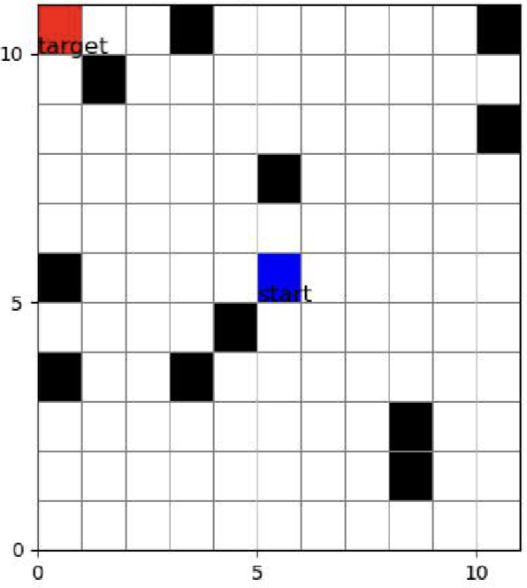
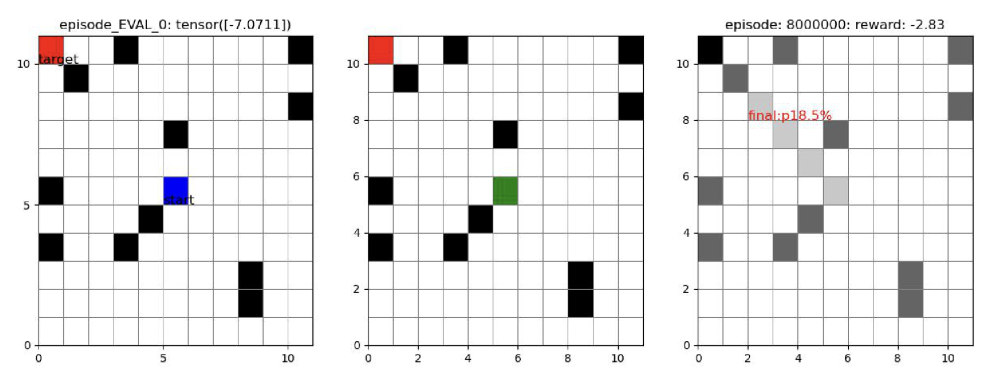
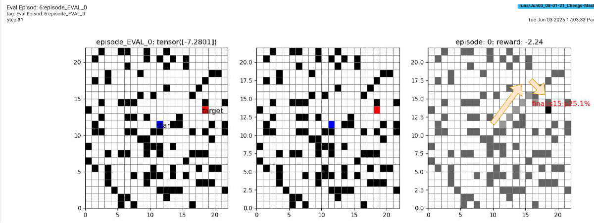
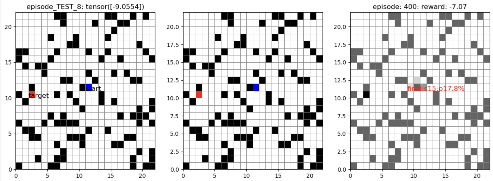
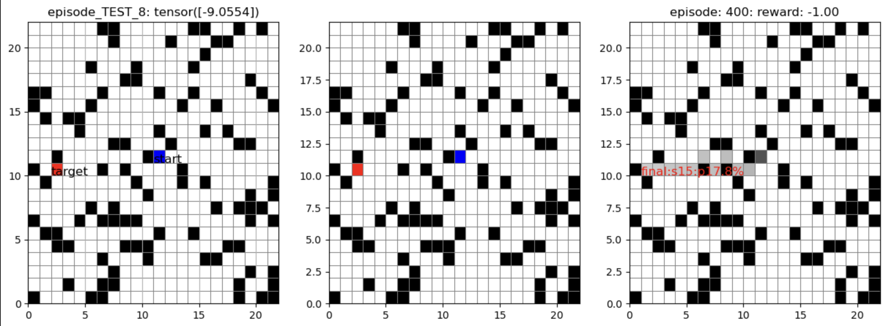

# Project: Predict the trajectory in an environment with BLOCKs.
----
- **Env**: N x M (rows x columns) grid with random generated BLOCKs
- **Inputs**:
  - start position: (x0, y0)
  - target position: (xt, yt)
- **Rules**:
  - ONLY allow move within the grid
  - CANNOT move to the BLOCK position
  - At any time, possible moves are:
     [top-left, top, top-right,
      left, current, right,
      bottom-left, bottom, bottom-right]
- **Example Setup**:

    

# Brainstorm 
---

# Project Architecture
---
## RF with GRPO

## Policy Model
----
### Linear Models
2 models here: 
 - linear model
 - linear model with late position fusion

    

### Example Solution

    

____
### Transformer w/ Late Fusion Model

    

### Example Solution

* Example from the evaluation result (topk=1) **The model learned move around the blocks**

    

* Example from the test result (topk=1) **The model learned move around the blocks**

    

* Example from the test result (topk=2). **The model learned move around the blocks**

    

## GRPO-Cheng Trainer
---

    

